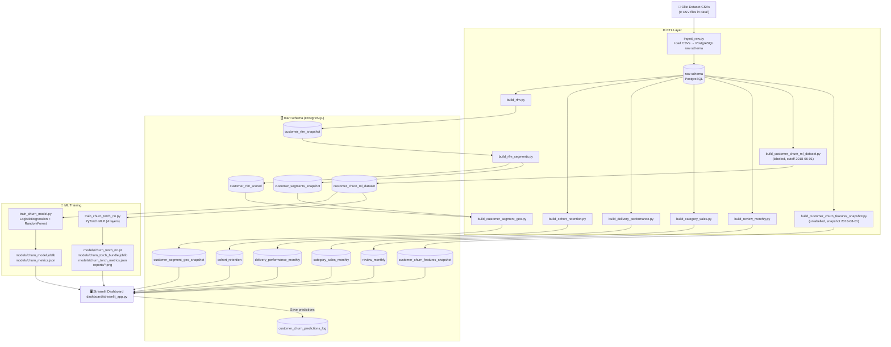
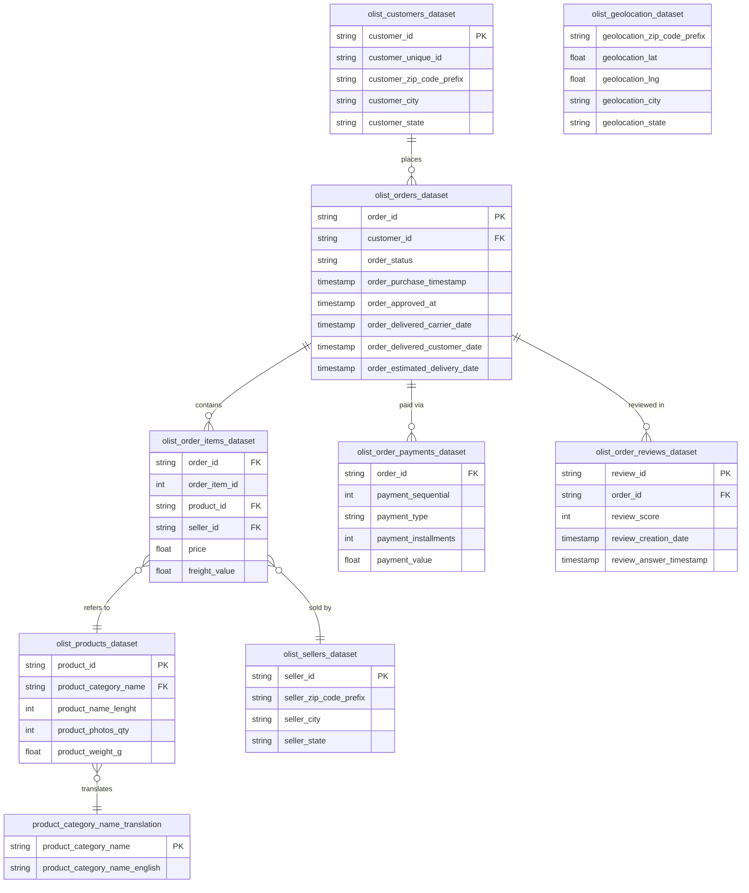

# Olist Customer Analytics & ML

> **End-to-end customer analytics platform** built on the [Olist Brazilian e-commerce dataset](https://www.kaggle.com/datasets/olistbr/brazilian-ecommerce).  
> Covers the full data-engineering → analytics → machine-learning → dashboard lifecycle.

---

## Table of Contents

1. [Project Overview](#1-project-overview)
2. [Tech Stack](#2-tech-stack)
3. [Directory Structure](#3-directory-structure)
4. [Project Flowchart](#4-project-flowchart)
5. [ER Diagram (Raw Dataset)](#5-er-diagram-raw-dataset)
6. [Database Schema](#6-database-schema)
   - [Raw Schema](#61-raw-schema)
   - [Mart Schema](#62-mart-schema)
7. [Dataset Description](#7-dataset-description)
8. [Setup & Installation](#8-setup--installation)
   - [Prerequisites](#81-prerequisites)
   - [Windows](#82-windows)
   - [Linux / macOS](#83-linux--macos)
9. [ETL Pipeline](#9-etl-pipeline)
10. [ML Training Pipeline](#10-ml-training-pipeline)
    - [RandomForest Model](#101-randomforest-model)
    - [PyTorch Neural Network](#102-pytorch-neural-network)
    - [Model Performance](#103-model-performance)
11. [Streamlit Dashboard](#11-streamlit-dashboard)
    - [Analytics Sections](#111-analytics-sections)
    - [AI / ML Sections](#112-ai--ml-sections)
12. [Configuration Reference](#12-configuration-reference)

---

## 1. Project Overview

This project turns the raw Olist CSV files into a fully-featured analytics and ML platform:

| Layer | What it does |
|---|---|
| **ETL** | Ingests 9 raw CSV files into PostgreSQL; builds 10+ analytics mart tables |
| **Analytics** | RFM segmentation, cohort retention, delivery performance, category sales, review trends |
| **Machine Learning** | Binary reorder/churn prediction (will the customer reorder within 90 days?) using RandomForest and a PyTorch MLP |
| **Dashboard** | Interactive Streamlit app with filters, charts, single-customer prediction, batch CSV scoring, and a persistent prediction log |

**Key highlights**

- Rerunnable, idempotent ETL scripts (safe to run multiple times)
- Two ML models selectable at runtime: scikit-learn RandomForest and a PyTorch MLP
- Adjustable probability threshold with risk banding (High / Medium / Low)
- Batch CSV upload for scoring company data
- Every prediction run is logged to the database with a unique `run_id` for auditability

---

## 2. Tech Stack

| Category | Libraries / Tools |
|---|---|
| Language | Python 3.10+ |
| Database | PostgreSQL (≥ 13) |
| ORM / DB connector | SQLAlchemy, psycopg2-binary |
| Data processing | pandas, numpy |
| Machine learning | scikit-learn (RandomForest, LogisticRegression, pipelines, preprocessors) |
| Deep learning | PyTorch (MLP, BCEWithLogitsLoss, Adam) |
| Model persistence | joblib |
| Visualisation | Plotly, Matplotlib, Seaborn |
| Dashboard | Streamlit |
| Configuration | python-dotenv |

---

## 3. Directory Structure

```
olist-customer-analytics-ml/
│
├── data/                          # ← raw Olist CSV files (git-ignored, not included)
│
├── etl/                           # ETL scripts (run in order)
│   ├── ingest_raw.py              # Load CSVs → raw schema
│   ├── build_rfm.py               # RFM metrics snapshot
│   ├── build_rfm_segments.py      # RFM scoring + segment labels
│   ├── build_customer_segment_geo.py  # Segments enriched with geo data
│   ├── build_cohort_retention.py  # Cohort retention table
│   ├── build_delivery_performance.py  # Delivery KPIs by month
│   ├── build_category_sales.py    # Revenue/orders by category & month
│   ├── build_review_monthly.py    # Review scores by month
│   ├── build_customer_churn_ml_dataset.py  # Labelled ML training set
│   └── build_customer_churn_features_snapshot.py  # Unlabelled scoring set
│
├── ml/                            # ML training scripts
│   ├── train_churn_model.py       # RandomForest + LogisticRegression
│   └── train_churn_torch_nn.py    # PyTorch MLP
│
├── models/                        # Saved model artefacts
│   ├── churn_model.joblib         # Best sklearn model (RandomForest)
│   ├── churn_metrics.json         # sklearn training metrics
│   ├── churn_torch_nn.pt          # PyTorch weights
│   ├── churn_torch_bundle.joblib  # Preprocessor + model metadata
│   ├── churn_torch_metrics.json   # PyTorch training metrics
│   └── churn_torch_history.csv    # Per-epoch training history
│
├── reports/                       # Training diagnostic plots
│   ├── torch_nn_loss.png
│   ├── torch_nn_val_pr_auc.png
│   ├── torch_nn_pr_curve.png
│   └── torch_nn_confusion_matrix.png
│
├── dashboard/
│   └── streamlit_app.py           # Main Streamlit application
│
├── config/                        # Runtime configuration (git-ignored)
│   └── settings.env               # DB credentials (copy from .env.example)
│
├── .env.example                   # Template for settings.env
├── requirements.txt               # Python dependencies
└── README.md
```

---

## 4. Project Flowchart

The diagram below shows the full end-to-end data flow, from raw CSV files through to the Streamlit dashboard.



---

## 5. ER Diagram (Raw Dataset)

The nine Olist CSV files map to the following entities and relationships in the `raw` PostgreSQL schema.



---

## 6. Database Schema

### 6.1 Raw Schema

Tables are loaded 1-to-1 from the CSV files by `etl/ingest_raw.py`.

| Table | Source CSV | Key columns |
|---|---|---|
| `raw.olist_customers_dataset` | `olist_customers_dataset.csv` | `customer_id`, `customer_unique_id`, `customer_state` |
| `raw.olist_orders_dataset` | `olist_orders_dataset.csv` | `order_id`, `customer_id`, `order_status`, timestamps |
| `raw.olist_order_items_dataset` | `olist_order_items_dataset.csv` | `order_id`, `product_id`, `seller_id`, `price`, `freight_value` |
| `raw.olist_order_payments_dataset` | `olist_order_payments_dataset.csv` | `order_id`, `payment_type`, `payment_value` |
| `raw.olist_products_dataset` | `olist_products_dataset.csv` | `product_id`, `product_category_name` |
| `raw.olist_order_reviews_dataset` | `olist_order_reviews_dataset.csv` | `review_id`, `order_id`, `review_score` |
| `raw.olist_sellers_dataset` | `olist_sellers_dataset.csv` | `seller_id`, `seller_state` |
| `raw.olist_geolocation_dataset` | `olist_geolocation_dataset.csv` | zip prefix, lat, lng |
| `raw.product_category_name_translation` | `product_category_name_translation.csv` | Portuguese → English category names |

### 6.2 Mart Schema

Analytics-ready tables produced by the ETL scripts.

| Table | Produced by | Description |
|---|---|---|
| `mart.customer_rfm_snapshot` | `build_rfm.py` | Per-customer recency, frequency, monetary + tenure (one row per snapshot date) |
| `mart.customer_rfm_scored` | `build_rfm_segments.py` | RFM with R/F/M quintile scores (1–5) and composite `rfm_score` |
| `mart.customer_segments_snapshot` | `build_rfm_segments.py` | Business-friendly segment labels (Champions, Loyal, At Risk, …) |
| `mart.customer_segment_geo_snapshot` | `build_customer_segment_geo.py` | Segments enriched with `customer_state` and `customer_city` |
| `mart.cohort_retention` | `build_cohort_retention.py` | Monthly cohort × period retention counts and rates |
| `mart.delivery_performance_monthly` | `build_delivery_performance.py` | Avg delivery days, avg estimated days, late order count & rate by month |
| `mart.category_sales_monthly` | `build_category_sales.py` | Orders, items, revenue by product category and month |
| `mart.review_monthly` | `build_review_monthly.py` | Avg review score, % 1-star, % 5-star by month |
| `mart.customer_churn_ml_dataset` | `build_customer_churn_ml_dataset.py` | **Labelled** ML training dataset – includes `will_reorder_90d` target |
| `mart.customer_churn_features_snapshot` | `build_customer_churn_features_snapshot.py` | **Unlabelled** feature snapshot for live scoring in the dashboard |
| `mart.customer_churn_predictions_log` | Streamlit app | Audit log of every prediction run (keyed by `run_id`) |

**Key mart columns used in ML**

| Column | Meaning |
|---|---|
| `recency_days` | Days between snapshot date and customer's last delivered order |
| `frequency` | Number of distinct delivered orders |
| `monetary` | Total spend (price + freight) on delivered orders |
| `avg_delivery_days` | Average actual delivery time in days |
| `late_rate` | Share of orders delivered after estimated date (0–1) |
| `avg_review_score` | Average review score across delivered orders (1–5) |
| `customer_state` | Brazilian state code (categorical) |
| `will_reorder_90d` | **Target label** – 1 if customer placed another order within 90 days of cutoff |

---

## 7. Dataset Description

The [Olist dataset](https://www.kaggle.com/datasets/olistbr/brazilian-ecommerce) covers **~100k orders** placed on the Olist marketplace between **2016 and 2018**.

| File | Rows (approx.) | Notes |
|---|---|---|
| `olist_customers_dataset.csv` | 99,441 | One row per order customer (use `customer_unique_id` across orders) |
| `olist_orders_dataset.csv` | 99,441 | Order lifecycle with status and timestamps |
| `olist_order_items_dataset.csv` | 112,650 | Line items (one order can have multiple items) |
| `olist_order_payments_dataset.csv` | 103,886 | Payment methods and values |
| `olist_products_dataset.csv` | 32,951 | Product catalogue with category |
| `olist_order_reviews_dataset.csv` | 99,224 | Customer reviews (score 1–5) |
| `olist_sellers_dataset.csv` | 3,095 | Seller master data |
| `olist_geolocation_dataset.csv` | 1,000,163 | ZIP code → lat/lng (used optionally) |
| `product_category_name_translation.csv` | 71 | Portuguese → English category name mapping |

> **Important:** Raw dataset files are **not included** in this repository (`data/` is git-ignored).  
> Download them from Kaggle and place them in the `data/` folder before running the ETL.

---

## 8. Setup & Installation

### 8.1 Prerequisites

- Python 3.10 or later
- PostgreSQL 13 or later (local or remote)
- Olist CSV files placed in `data/`
- `raw` and `mart` schemas created in your PostgreSQL database (see below)

**Create schemas in PostgreSQL**

```sql
CREATE SCHEMA IF NOT EXISTS raw;
CREATE SCHEMA IF NOT EXISTS mart;
```

**Create the mart tables** (required before running ETL scripts)

```sql
-- RFM
CREATE TABLE IF NOT EXISTS mart.customer_rfm_snapshot (
    snapshot_date DATE, customer_unique_id TEXT,
    recency_days INT, frequency INT, monetary NUMERIC(18,2),
    last_purchase_timestamp TIMESTAMP, first_purchase_timestamp TIMESTAMP, tenure_days INT
);

CREATE TABLE IF NOT EXISTS mart.customer_rfm_scored (
    snapshot_date DATE, customer_unique_id TEXT,
    recency_days INT, frequency INT, monetary NUMERIC(18,2),
    r_score INT, f_score INT, m_score INT, rfm_score TEXT
);

CREATE TABLE IF NOT EXISTS mart.customer_segments_snapshot (
    snapshot_date DATE, customer_unique_id TEXT, segment_name TEXT,
    r_score INT, f_score INT, m_score INT,
    recency_days INT, frequency INT, monetary NUMERIC(18,2)
);

CREATE TABLE IF NOT EXISTS mart.customer_segment_geo_snapshot (
    snapshot_date DATE, customer_unique_id TEXT, segment_name TEXT,
    customer_state TEXT, customer_city TEXT,
    monetary NUMERIC(18,2), frequency INT, recency_days INT
);

-- Cohort
CREATE TABLE IF NOT EXISTS mart.cohort_retention (
    cohort_month DATE, order_month DATE, period_number INT,
    customers INT, cohort_size INT, retention_rate NUMERIC(8,4)
);

-- Delivery
CREATE TABLE IF NOT EXISTS mart.delivery_performance_monthly (
    order_month DATE, orders INT,
    avg_delivery_days NUMERIC(8,2), avg_estimated_days NUMERIC(8,2),
    late_orders INT, late_rate NUMERIC(8,4)
);

-- Sales
CREATE TABLE IF NOT EXISTS mart.category_sales_monthly (
    order_month DATE, product_category_name TEXT,
    orders INT, items INT, revenue NUMERIC(18,2)
);

-- Reviews
CREATE TABLE IF NOT EXISTS mart.review_monthly (
    review_month DATE, reviews INT,
    avg_review_score NUMERIC(8,2), pct_1_star NUMERIC(8,4), pct_5_star NUMERIC(8,4)
);

-- ML datasets
CREATE TABLE IF NOT EXISTS mart.customer_churn_ml_dataset (
    snapshot_date DATE, customer_unique_id TEXT,
    recency_days INT, frequency INT, monetary NUMERIC(18,2),
    avg_delivery_days NUMERIC(10,2), late_rate NUMERIC(10,4),
    avg_review_score NUMERIC(10,2), customer_state TEXT,
    will_reorder_90d INT
);

CREATE TABLE IF NOT EXISTS mart.customer_churn_features_snapshot (
    snapshot_date DATE, customer_unique_id TEXT,
    recency_days INT, frequency INT, monetary NUMERIC(18,2),
    avg_delivery_days NUMERIC(10,2), late_rate NUMERIC(10,4),
    avg_review_score NUMERIC(10,2), customer_state TEXT
);

-- Prediction log
CREATE TABLE IF NOT EXISTS mart.customer_churn_predictions_log (
    id BIGSERIAL PRIMARY KEY,
    run_id TEXT, source TEXT, snapshot_date DATE,
    model_name TEXT, threshold NUMERIC(8,4),
    customer_unique_id TEXT,
    recency_days NUMERIC, frequency NUMERIC, monetary NUMERIC,
    avg_delivery_days NUMERIC, late_rate NUMERIC, avg_review_score NUMERIC,
    customer_state TEXT, reorder_proba_90d NUMERIC(10,6), risk_bucket TEXT,
    created_at TIMESTAMP DEFAULT NOW()
);
```

---

### 8.2 Windows

```bat
:: 1. Clone the repository
git clone https://github.com/Hereakash/olist-customer-analytics-ml.git
cd olist-customer-analytics-ml

:: 2. Create and activate virtual environment (optional but recommended)
python -m venv .venv
.venv\Scripts\activate

:: 3. Install dependencies
pip install -r requirements.txt

:: 4. Configure database credentials
::    DO NOT commit real passwords — this file is git-ignored
mkdir config
copy .env.example config\settings.env
::    Now open config\settings.env and fill in your DB_HOST, DB_NAME, DB_USER, DB_PASSWORD

:: 5. Place Olist CSV files in data\
::    (Download from https://www.kaggle.com/datasets/olistbr/brazilian-ecommerce)

:: 6. Run the ETL pipeline (see Section 9 for full details)
python etl\ingest_raw.py
python etl\build_rfm.py
python etl\build_rfm_segments.py
python etl\build_customer_segment_geo.py
python etl\build_cohort_retention.py
python etl\build_delivery_performance.py
python etl\build_category_sales.py
python etl\build_review_monthly.py
python etl\build_customer_churn_ml_dataset.py
python etl\build_customer_churn_features_snapshot.py

:: 7. Train ML models (optional — pre-trained artefacts are included)
python ml\train_churn_model.py
python ml\train_churn_torch_nn.py

:: 8. Launch the Streamlit dashboard
streamlit run dashboard\streamlit_app.py
```

### 8.3 Linux / macOS

```bash
# 1. Clone the repository
git clone https://github.com/Hereakash/olist-customer-analytics-ml.git
cd olist-customer-analytics-ml

# 2. Create and activate virtual environment
python3 -m venv .venv
source .venv/bin/activate

# 3. Install dependencies
pip install -r requirements.txt

# 4. Configure database credentials
mkdir -p config
cp .env.example config/settings.env
# Open config/settings.env and fill in DB_HOST, DB_NAME, DB_USER, DB_PASSWORD

# 5. Place Olist CSV files in data/

# 6. Run the ETL pipeline
python etl/ingest_raw.py
python etl/build_rfm.py
python etl/build_rfm_segments.py
python etl/build_customer_segment_geo.py
python etl/build_cohort_retention.py
python etl/build_delivery_performance.py
python etl/build_category_sales.py
python etl/build_review_monthly.py
python etl/build_customer_churn_ml_dataset.py
python etl/build_customer_churn_features_snapshot.py

# 7. Train ML models (optional)
python ml/train_churn_model.py
python ml/train_churn_torch_nn.py

# 8. Launch the dashboard
streamlit run dashboard/streamlit_app.py
```

---

## 9. ETL Pipeline

All scripts read from `config/settings.env` for database connection. They are idempotent – safe to rerun.

```
Step 1: ingest_raw.py
  Reads each CSV from data/ and loads it into raw.<table_name> using
  pd.to_sql(if_exists="replace"). Skips missing files gracefully.

Step 2: build_rfm.py
  Joins raw.olist_orders_dataset + raw.olist_customers_dataset +
  raw.olist_order_payments_dataset to compute per-customer:
    recency_days, frequency (distinct orders), monetary (total spend),
    tenure_days, first/last purchase timestamps.
  Writes to mart.customer_rfm_snapshot.

Step 3: build_rfm_segments.py
  Reads mart.customer_rfm_snapshot.
  Assigns quintile R/F/M scores (1–5) using pd.qcut.
  Maps (R, F, M) → segment_name via business rules:
    Champions, Loyal Customers, New Customers, At Risk,
    Hibernating, Can't Lose Them, Potential Loyalists, Need Attention.
  Writes to mart.customer_rfm_scored + mart.customer_segments_snapshot.

Step 4: build_customer_segment_geo.py
  Joins mart.customer_segments_snapshot with raw.olist_customers_dataset
  to add customer_state and customer_city.
  Writes to mart.customer_segment_geo_snapshot.

Step 5: build_cohort_retention.py
  Identifies each customer's first-order cohort month.
  Computes customers retained in each subsequent period (0–N months later).
  Calculates retention_rate = period_customers / cohort_size.
  Writes to mart.cohort_retention.

Step 6: build_delivery_performance.py
  Aggregates delivered orders by month.
  Computes avg_delivery_days, avg_estimated_days, late_orders, late_rate.
  Writes to mart.delivery_performance_monthly.

Step 7: build_category_sales.py
  Joins orders + order_items + products.
  Aggregates orders, items, revenue by product_category_name and order_month.
  Writes to mart.category_sales_monthly.

Step 8: build_review_monthly.py
  Joins orders + reviews.
  Aggregates avg_review_score, pct_1_star, pct_5_star by month.
  Writes to mart.review_monthly.

Step 9: build_customer_churn_ml_dataset.py
  Time-based feature engineering with a CUTOFF_DATE (default 2018-06-01).
  Features computed from orders delivered BEFORE cutoff:
    recency_days, frequency, monetary, avg_delivery_days, late_rate,
    avg_review_score, customer_state.
  Label: will_reorder_90d = 1 if customer placed another order
    within 90 days after their last pre-cutoff delivery.
  Writes to mart.customer_churn_ml_dataset.

Step 10: build_customer_churn_features_snapshot.py
  Same feature computation as Step 9 but for SNAPSHOT_DATE (default 2018-08-01),
  without the label column (for live scoring).
  Writes to mart.customer_churn_features_snapshot.
```

---

## 10. ML Training Pipeline

### 10.1 RandomForest Model

**Script:** `ml/train_churn_model.py`

```
Input:  mart.customer_churn_ml_dataset (snapshot_date = 2018-06-01)
Target: will_reorder_90d (binary, severely imbalanced ~0.16% positive rate)

Preprocessing pipeline (sklearn):
  Numeric features  → SimpleImputer(strategy="median")
  Categorical       → SimpleImputer(most_frequent) + OneHotEncoder(handle_unknown="ignore")

Models trained and compared:
  1. LogisticRegression  (max_iter=2000, class_weight="balanced")
  2. RandomForestClassifier (n_estimators=400, class_weight="balanced_subsample",
                              min_samples_leaf=5)

Selection: best PR-AUC on hold-out test set (25% stratified split)

Outputs:
  models/churn_model.joblib   → best Pipeline object (preprocessor + model)
  models/churn_metrics.json   → all metrics for both models
```

### 10.2 PyTorch Neural Network

**Script:** `ml/train_churn_torch_nn.py`

```
Architecture (MLP):
  Linear(input_dim → 256) → ReLU → Dropout(0.30)
  Linear(256 → 128)       → ReLU → Dropout(0.25)
  Linear(128 → 64)        → ReLU → Dropout(0.20)
  Linear(64 → 1)          → [logits]

Training details:
  Loss:      BCEWithLogitsLoss with pos_weight = neg_count / pos_count
             (handles class imbalance without oversampling)
  Optimizer: Adam(lr=1e-3, weight_decay=1e-5)
  Batch:     4096
  Epochs:    up to 50 with early stopping (patience=8 on val PR-AUC)
  Split:     75% train (80/20 train/val) | 25% test (stratified)
  Device:    CUDA if available, else CPU

Threshold selection:
  Best threshold chosen by maximising F1 on the precision-recall curve.

Outputs:
  models/churn_torch_nn.pt            → model state_dict
  models/churn_torch_bundle.joblib    → preprocessor + input_dim + weights path
  models/churn_torch_metrics.json     → all metrics + best threshold
  models/churn_torch_history.csv      → per-epoch train_loss, val_roc_auc, val_pr_auc
  reports/torch_nn_loss.png           → training loss curve
  reports/torch_nn_val_pr_auc.png     → validation PR-AUC curve
  reports/torch_nn_pr_curve.png       → precision-recall curve on test set
  reports/torch_nn_confusion_matrix.png → confusion matrix at best threshold
```

### 10.3 Model Performance

Results on the test set (snapshot_date = 2018-06-01, 73,240 rows, 118 positives):

| Model | ROC-AUC | PR-AUC | Notes |
|---|---|---|---|
| Logistic Regression | 0.881 | 0.009 | Balanced class weight |
| **RandomForest** ✓ | **0.873** | **0.010** | Best PR-AUC among sklearn models |
| **PyTorch MLP** | **0.884** | **0.015** | Best overall; threshold = 0.992 (F1-optimal) |

> **Note on low PR-AUC:** The dataset is extremely imbalanced (only ~118 reorders out of 73k customers in 90 days after the cutoff). PR-AUC is the correct metric for this task. The models demonstrate strong ROC-AUC and effective risk ranking even with low absolute PR-AUC.

---

## 11. Streamlit Dashboard

Launch with:
```bash
streamlit run dashboard/streamlit_app.py
```

### 11.1 Analytics Sections

| Section | Description |
|---|---|
| **KPI tiles** | Total customers, avg monetary, avg frequency, avg recency – filtered by state / segment |
| **RFM Segments** | Bar chart of segment distribution; top states; top-50 customers by spend |
| **Cohort Retention** | Heatmap (log-scaled) of monthly retention for periods 1–6; full retention rate table |
| **Delivery Performance** | Line chart of actual vs estimated delivery days; late-rate bar chart by month |
| **Category Sales** | Top-15 categories by total revenue; monthly revenue trend (all or single category) |
| **Customer Satisfaction** | Avg review score trend; % 1-star vs % 5-star; scatter of late-rate vs avg review score |

**Sidebar filters** (applied to all analytics sections):
- Customer state
- RFM segment
- Product category
- AI snapshot date
- AI model (RandomForest / PyTorch NN)
- Probability threshold (slider 0–1)

### 11.2 AI / ML Sections

**Tab 1 – Snapshot scoring (DB)**
- Loads `mart.customer_churn_features_snapshot` for the selected snapshot date
- Scores all customers with the selected model
- Shows risk-band bar chart, probability distribution histogram, and insights summary
- Save all predictions to `mart.customer_churn_predictions_log` with a unique `run_id`

**Tab 2 – Single customer predictor**
- Manual input form (state, recency, frequency, monetary, delivery days, late rate, review score)
- Instantly shows predicted probability, risk badge (High / Medium / Low), and tailored suggestions
- Option to save the single prediction to the DB log

**Tab 3 – Batch upload (CSV)**
- Download a filled template CSV
- Upload your own CSV with the same columns
- Scores every row and shows results + insights
- Option to save all batch predictions to the DB log

**Tab 4 – Prediction log (DB)**
- Browse all past prediction runs from `mart.customer_churn_predictions_log`
- Filter by `run_id`, model name, or risk bucket
- Charts showing prediction history over time

**Risk bands**

| Band | Condition | Recommended action |
|---|---|---|
| 🔴 **High** | probability ≥ threshold | Retention outreach within 24–48 h; coupon for high-value customers; logistics investigation if late deliveries |
| 🟡 **Medium** | probability ≥ 0.5 × threshold | Nudge campaign; feedback request; upsell for frequent buyers |
| 🟢 **Low** | probability < 0.5 × threshold | Upsell / cross-sell; referral / loyalty programs |

---

## 12. Configuration Reference

Copy `.env.example` to `config/settings.env` and fill in your values.  
**Never commit `config/settings.env`** — it is listed in `.gitignore`.

| Variable | Default | Description |
|---|---|---|
| `DB_HOST` | `localhost` | PostgreSQL host |
| `DB_PORT` | `5432` | PostgreSQL port |
| `DB_NAME` | *(required)* | Database name |
| `DB_USER` | *(required)* | Database user |
| `DB_PASSWORD` | *(required)* | Database password |

**ML cutoff / snapshot dates** (edit in the scripts if needed)

| Script | Variable | Default | Notes |
|---|---|---|---|
| `build_customer_churn_ml_dataset.py` | `CUTOFF_DATE` | `2018-06-01` | Must leave ≥ 90 days of future data for labels |
| `build_customer_churn_features_snapshot.py` | `SNAPSHOT_DATE` | `2018-08-01` | Any date with enough historical data |
| `train_churn_model.py` | `TRAIN_SNAPSHOT_DATE` | `2018-06-01` | Must match CUTOFF_DATE |
| `train_churn_torch_nn.py` | `TRAIN_SNAPSHOT_DATE` | `2018-06-01` | Must match CUTOFF_DATE |

---

> **Data privacy:** Raw dataset files (`data/`) and database credentials (`config/settings.env`) are excluded from version control via `.gitignore`.