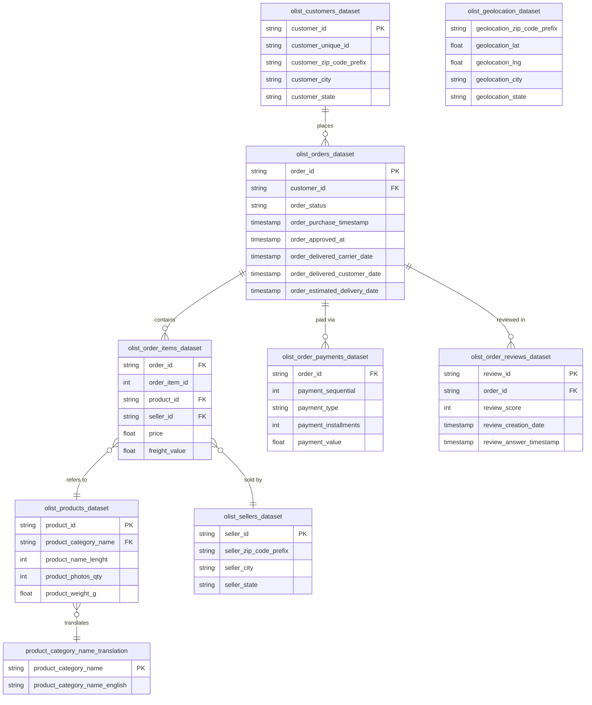
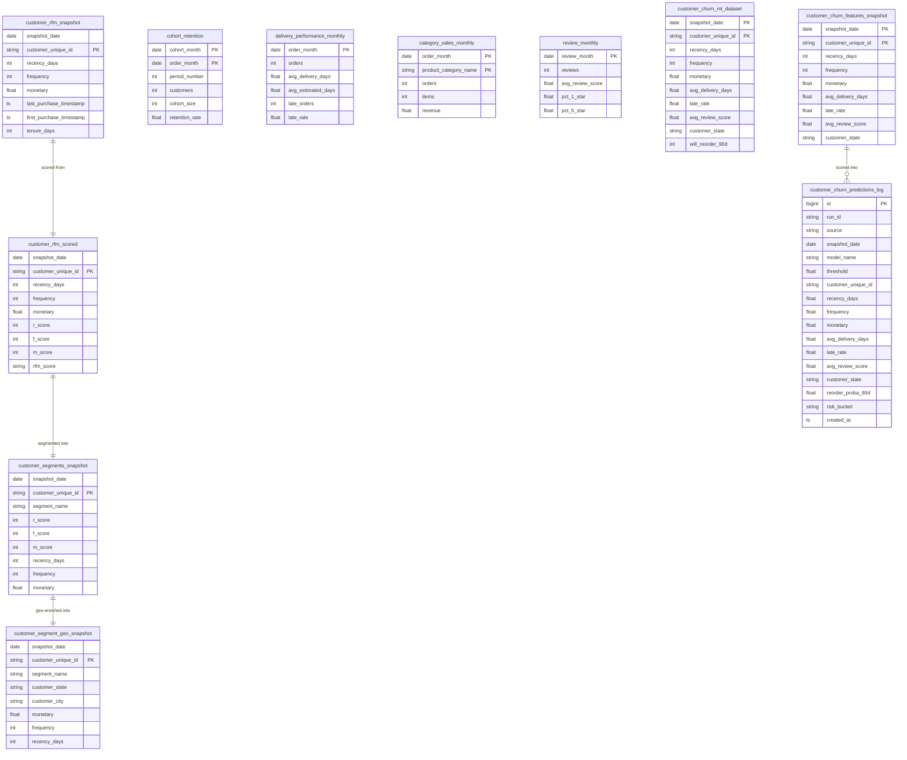

# ER Diagram

This document shows the entity-relationship structure for the Olist project across two layers:

1. **Raw schema** – tables loaded 1-to-1 from the nine Olist CSV files.
2. **Mart schema** – analytics and ML tables derived by ETL scripts.

---

## Raw Schema ER Diagram

The nine source CSV files map to the following entities and relationships in the `raw` PostgreSQL schema.

> **Note:** `olist_geolocation_dataset` is not directly joined in the ETL scripts; it is available for optional geo enrichment by matching on `zip_code_prefix`.

---

## Mart Schema ER Diagram

The mart tables are derived aggregates. Primary/foreign keys are logical (not enforced as DB constraints), and most tables are written with `pd.to_sql(if_exists="replace")`.

---

## Notes

- Composite primary keys are `(snapshot_date, customer_unique_id)` for RFM and ML tables; `(cohort_month, order_month)` for cohort retention; `(order_month, product_category_name)` for category sales.
- No foreign key constraints are enforced in the database; relationships are maintained at the application/ETL layer.
- For full column DDL, see the [Database documentation](DATABASE.md) and the setup SQL in [README.md](../README.md#8-setup--installation).
