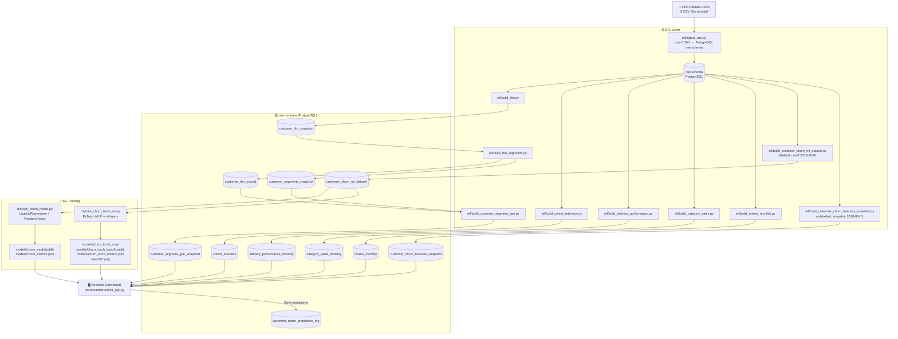
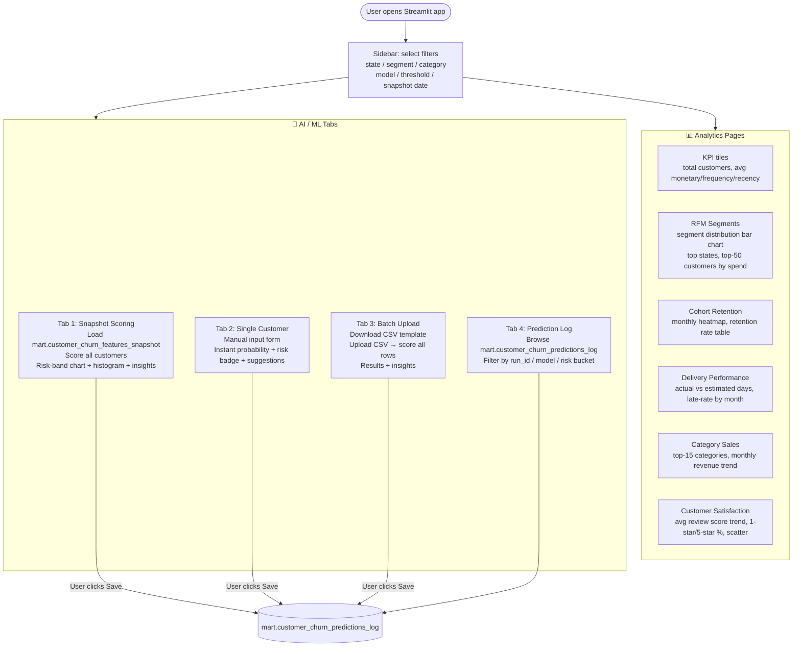
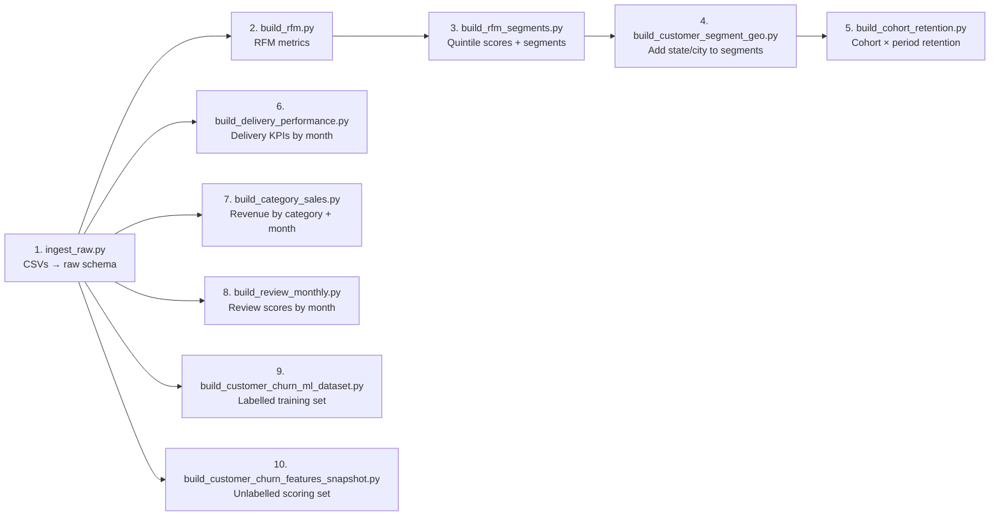
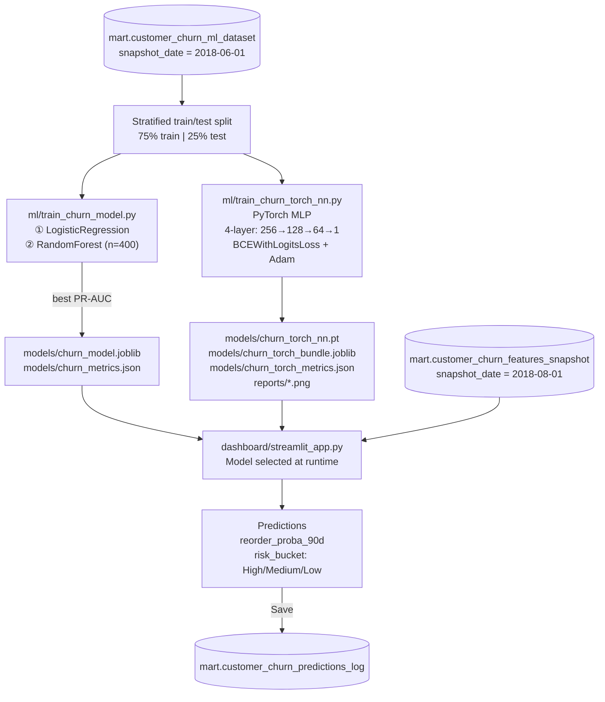

# Project Flowchart

This document describes the end-to-end flow of the Olist Customer Analytics & ML project, from raw data ingestion through to the Streamlit dashboard.

---

## Full Project Flowchart

---

## Dashboard User Flow

---

## ETL Execution Order

The ETL scripts must be run in the following order. All scripts are idempotent (safe to rerun).

> Steps 5–10 all depend only on the raw schema (step 1). Steps 3 and 4 depend on previous mart tables.

---

## ML Training Flow

